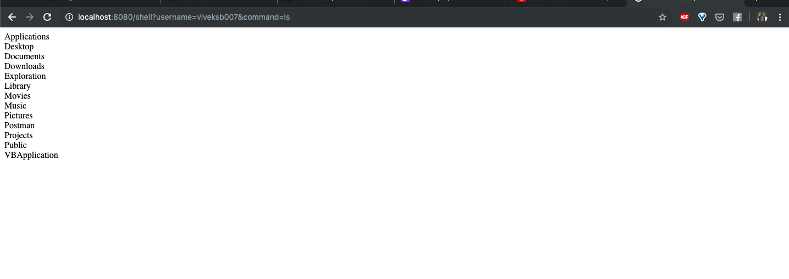

# rest-based-shell

This project is intended to be able to run commands where your application is hosted if a terminal is not exposed to you. 

This REST based application simply takes the command and executes using shell. I tried to emulate real behaviour of system shell.
So added a **username** parameter, this differentiates the directory state of each shell. Using the endpoint with different usernames is similar to using two terminal windows.

## Development

To run it locally simply clone the project and run
`gradle clean build` and run the jar from build/libs folder.

If you are using IntelliJ, just import the project and run `main()` of **`ApplicationKt`**

After application is up and running, you can head over to `localhost:8080` (username,password -> admin, admin)

### Screenshot

## Contribution
Feel free to checkout the project, submit issues and enhancement requests. 
